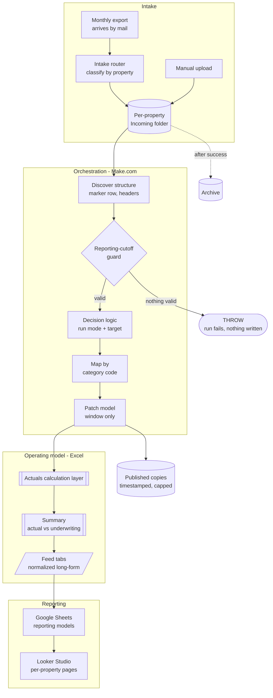
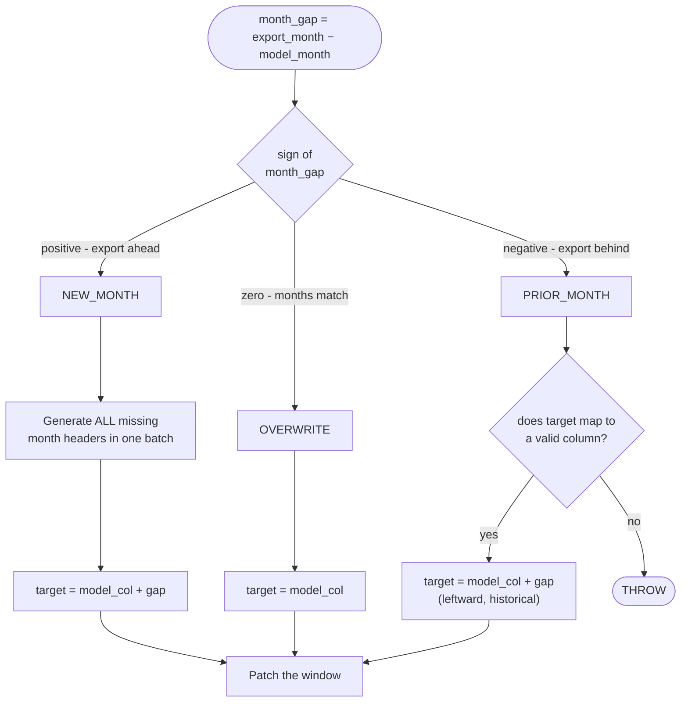
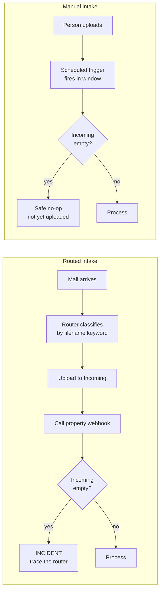
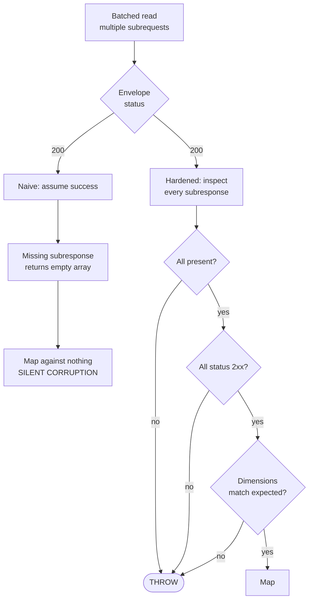
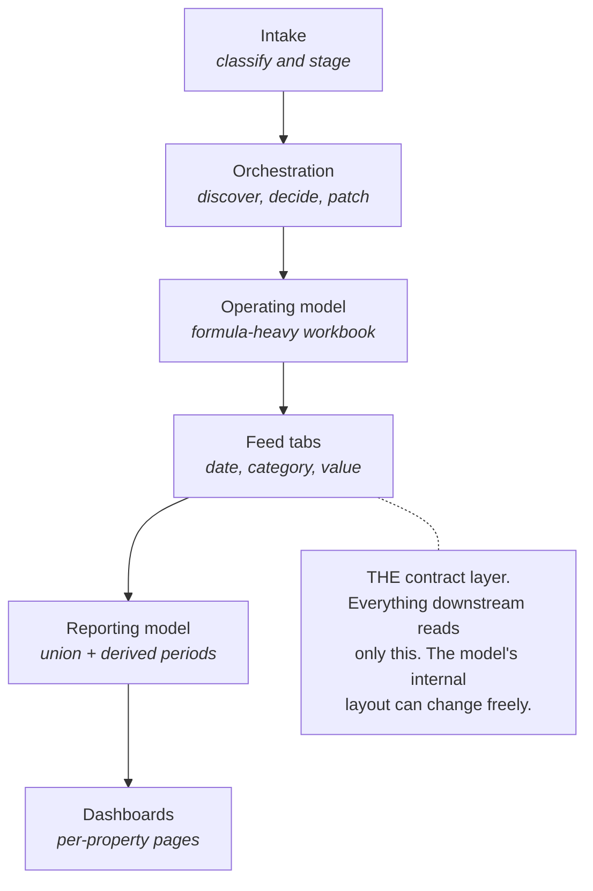

# Diagrams

Mermaid source - renders natively on GitHub and adapts to light/dark themes.

## End-to-end pipeline

## Decision state machine

The core logic. Compares the model's latest month against the export's guarded effective month.

`PRIOR_MONTH` exists because treating a stale export as an overwrite of the current column clears live data - see [case study 02](../case-studies/02-sparse-row-mapping-defect.md).

## Intake families

Why the same pipeline needs two failure interpretations.

An empty intake folder is an incident for one family and routine for the other. Encoding that distinction is what keeps the monthly run quiet enough that real failures stand out.

## Batch validation

The envelope can return HTTP 200 while individual subrequests fail.

## Layer contract

Each boundary has a defined input and output contract.

The operating model contains formula-driven sheets, chart pages, and variable row heights, so it is not used directly as a reporting source. Dedicated dynamic-array tabs expose normalized long-form tables for downstream systems.
